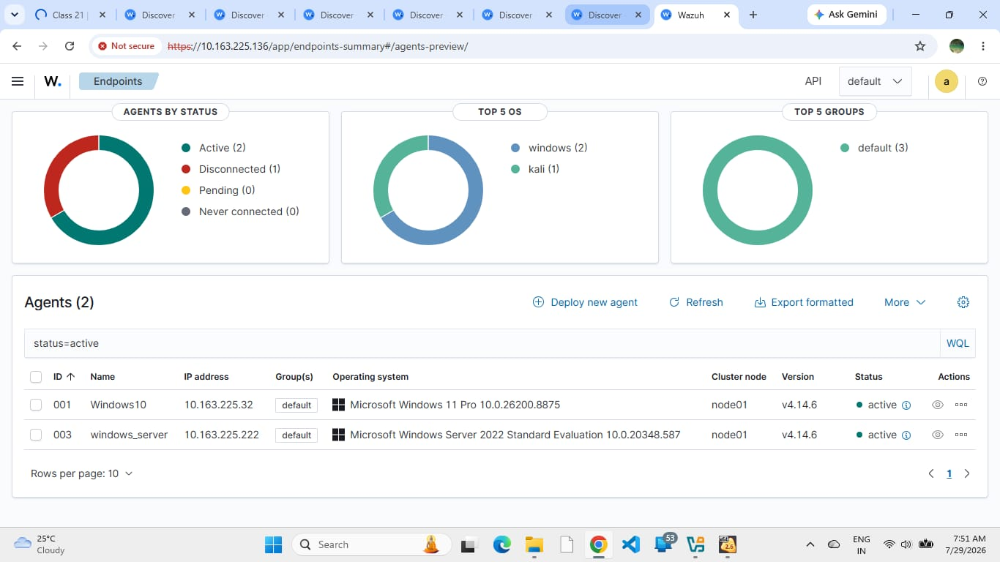

# 🔐 Active Directory Monitoring with Wazuh SIEM

A hands-on **SOC Home Lab** demonstrating the integration of **Active Directory with Wazuh SIEM** for centralized security monitoring, Windows Event Log analysis, threat detection, vulnerability assessment, and MITRE ATT&CK mapping.

---

## 📌 Project Overview

This project demonstrates the implementation of a **Security Operations Center (SOC) Home Lab** using Wazuh SIEM and Microsoft Active Directory.

The lab integrates a **Windows Server 2022 Domain Controller** and **Windows 10 Client** with Wazuh to collect, monitor, and analyze security events, authentication activities, and user account changes.

### 🎯 Objectives

* Centralized security log collection
* Windows Security Event monitoring
* Active Directory auditing
* User account activity monitoring
* Threat detection and analysis
* MITRE ATT&CK mapping
* Vulnerability assessment
* SOC monitoring workflow

---


# 🖥️ Environment Setup

| Component               | Details             |
| ----------------------- | ------------------- |
| SIEM                    | Wazuh               |
| Wazuh Version           | 4.14.6              |
| Host Machine            | PC                  |
| Wazuh Manager           | 10.x.x.x            |
| Domain Controller       | Windows Server 2022 |
| Windows Endpoint        | Windows 10          |
| Linux Endpoint          | 192.x.x.x           |
| Wazuh Agent             | Windows / Linux     |
| Active Directory Domain | `actived.com`       |
| Monitoring              | Wazuh Dashboard     |
| Threat Framework        | MITRE ATT&CK        |

---

# 🛠️ Tools & Technologies

| Category                | Technology                    |
| ----------------------- | ----------------------------- |
| SIEM                    | Wazuh                         |
| Directory Services      | Active Directory              |
| Operating System        | Windows Server 2022           |
| Endpoint                | Windows 10                    |
| Linux                   | Linux Endpoint                |
| Security Framework      | MITRE ATT&CK                  |
| Monitoring              | Wazuh Dashboard               |
| Security Analysis       | Windows Event Logs            |
| Vulnerability Detection | Wazuh Vulnerability Detection |

---

# ⚙️ Implementation

## 1. Active Directory Setup

Configured **Active Directory Domain Services (AD DS)** on Windows Server 2022.

### Configuration

* Installed Active Directory Domain Services
* Configured domain: `actived.com`
* Created Organizational Units (OUs)
* Created user accounts
* Configured users and groups
* Joined Windows 10 client to the domain

### 📸 Screenshot


---

## 2. Group Policy & Audit Configuration

Configured Windows Advanced Audit Policies to generate security events required for SOC monitoring.

### Audit Policies

* Audit User Account Management
* Audit Logon/Logoff
* Success Auditing
* Failure Auditing

### 📸 Screenshot


---

## 3. Wazuh Agent Deployment

Installed and configured **Wazuh Agents** on the monitored endpoints.

The agents forward security-related logs to the centralized Wazuh Manager for analysis and alert generation.

### Monitored Endpoints

* Windows Server 2022
* Windows 10 Client
* Linux Endpoint

### 📸 Screenshot



---

# 🔍 Security Event Monitoring

The following Windows Security Event IDs were monitored using Wazuh.

| Event ID | Detection             |
| -------: | --------------------- |
| **4624** | Successful Logon      |
| **4625** | Failed Logon          |
| **4720** | User Account Created  |
| **4738** | User Account Modified |
| **4726** | User Account Deleted  |

---

# 🚨 Event ID 4625 – Failed Logon

### Description

Indicates that a logon attempt failed.

### SOC Use Case

* Detect repeated authentication failures
* Identify suspicious login attempts
* Investigate possible brute-force activity

### 📸 Screenshot


---

# 🔐 Event ID 4624 – Successful Logon

### Description

Indicates that a user successfully logged on to the system.

### SOC Use Case

* Monitor authentication activity
* Identify unusual login behavior
* Support incident investigation

### 📸 Screenshot


---

# 👤 Event ID 4720 – User Account Created

### Description

Indicates that a new user account was created.

### SOC Use Case

* Monitor unauthorized account creation
* Detect suspicious account activity
* Investigate possible persistence

### 📸 Screenshot


---

# 🔧 Event ID 4738 – User Account Modified

### Description

Indicates that a user account was modified.

### SOC Use Case

* Monitor account modifications
* Detect suspicious administrative changes
* Investigate privilege-related activity

### 📸 Screenshot


---

# 🗑️ Event ID 4726 – User Account Deleted

### Description

Indicates that a user account was deleted.

### SOC Use Case

* Monitor account deletion
* Investigate unauthorized administrative activity
* Support incident investigation

### 📸 Screenshot

![Event ID 4726 - User Account Deleted]

---

# 🎯 MITRE ATT&CK Mapping

Security events were mapped to relevant **MITRE ATT&CK techniques** to understand their potential relationship with attacker behavior.

| Event ID | MITRE ATT&CK | Technique            |
| -------: | ------------ | -------------------- |
|     4625 | **T1110**    | Brute Force          |
|     4720 | **T1136**    | Create Account       |
|     4738 | **T1098**    | Account Manipulation |

### 📸 Screenshot


> **Note:** A single Windows Event ID does not prove that an attack occurred. Events are analyzed together with other indicators and contextual information.

---

# 🛡️ Vulnerability Detection

Wazuh was used to monitor connected endpoints for potential security weaknesses.

### Monitored Areas

* Software vulnerabilities
* Known CVEs
* System misconfigurations
* Security weaknesses
* Vulnerable packages

### 📸 Screenshot


---

# 🔄 SOC Monitoring Workflow

```text
                 Endpoint Activity
                         │
                         ▼
              Windows Security Logs
                         │
                         ▼
                    Wazuh Agent
                         │
                         ▼
                   Wazuh Manager
                         │
                         ▼
                    Log Analysis
                         │
                         ▼
                  Security Alert
                         │
                         ▼
                 Alert Investigation
                         │
                         ▼
                MITRE ATT&CK Mapping
                         │
                         ▼
                 Incident Analysis
```

---

# 🧠 Skills Demonstrated

* Active Directory Administration
* Windows Server 2022
* Group Policy Management
* Wazuh SIEM
* Wazuh Agent Deployment
* Windows Event Log Analysis
* Threat Detection
* Security Monitoring
* MITRE ATT&CK
* Vulnerability Assessment
* Incident Investigation
* SOC Analyst Workflow

---

# 📚 Learning Outcomes

Through this project, I gained hands-on experience in:

* Deploying Active Directory
* Managing users and Organizational Units
* Configuring Group Policy auditing
* Installing and configuring Wazuh Agents
* Collecting Windows Security Logs
* Analyzing Windows Event IDs
* Investigating authentication events
* Mapping security events to MITRE ATT&CK
* Performing vulnerability assessment
* Understanding SOC monitoring workflows

---

# ⚠️ Challenges Faced

* Wazuh Agent deployment and registration
* Agent connectivity troubleshooting
* Windows Audit Policy configuration
* Security Event ID analysis
* Windows security log collection
* MITRE ATT&CK event mapping
* Wazuh alert investigation

---

# 🚀 Future Improvements

* Sysmon Integration
* Custom Wazuh Detection Rules
* Sigma Detection Rules
* Active Response Automation
* Email Alerting
* Brute-Force Detection
* Ransomware Detection
* PowerShell Monitoring
* Threat Hunting
* TheHive Integration
* Automated Incident Response

---

# 🏁 Conclusion

This project demonstrates a practical **SOC monitoring environment using Wazuh and Active Directory**.

The lab provides hands-on experience in centralized security monitoring, Windows Event Log analysis, Active Directory auditing, threat detection, vulnerability assessment, and MITRE ATT&CK mapping.

It simulates key activities performed by a **SOC Analyst**, including security alert monitoring, log analysis, suspicious activity investigation, and threat detection.

---

# 👩‍💻 Author

**Tejashri**

**Cybersecurity | SOC Analyst | Security Monitoring**

---

⭐ **If you found this project useful, consider giving the repository a star!**
